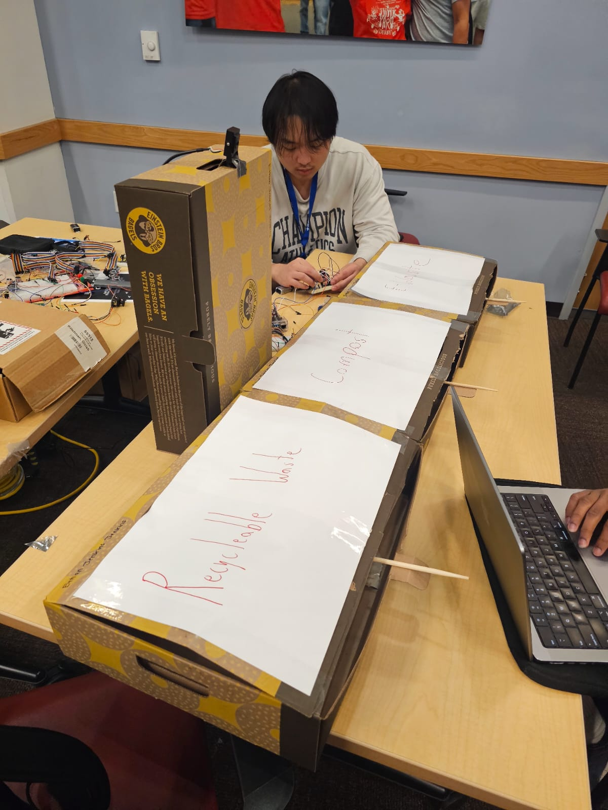
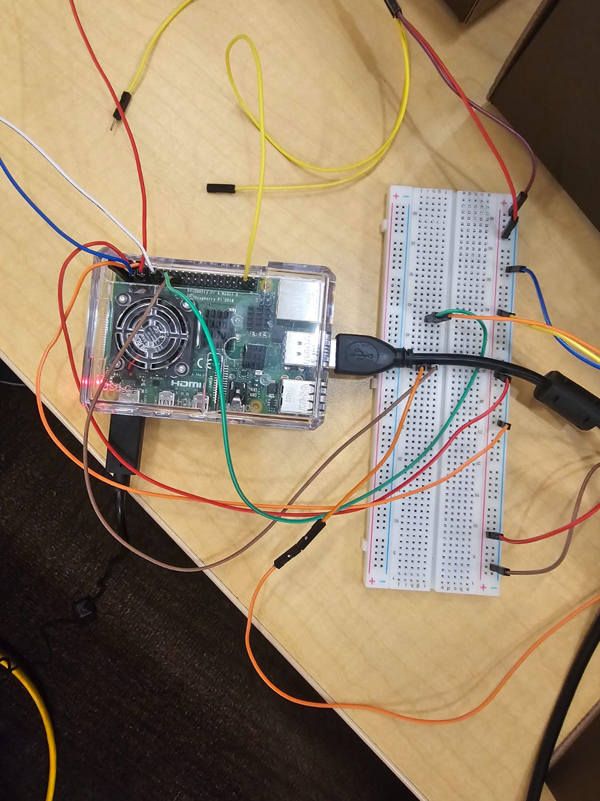
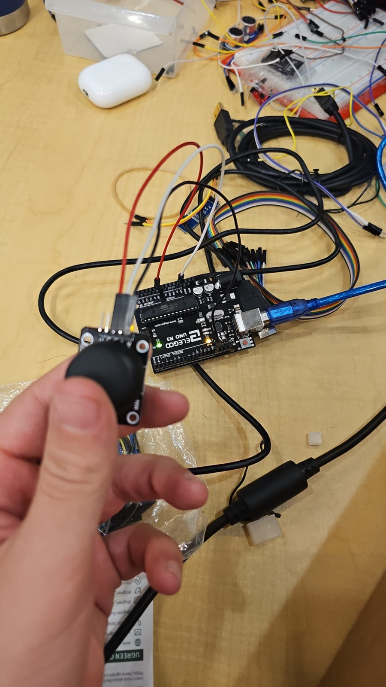

# Smart Waste Segregation and Gamification



[Demo Video Link](https://youtu.be/K040jr_ij-w)

## Inspiration
The staggering reality of waste management drove us to action:
- $200 billion spent annually on waste management
- 292.4M tons of municipal solid waste generated yearly
- 4.9 pounds of waste per person per day
- Only 69 million tons recycled vs 146.1 million tons landfilled

We saw an opportunity to make waste management both automated and educational, transforming a daily chore into an engaging learning experience.

## What it does
Our project combines two innovative components:

1. **Smart Waste Sorter:**
   
   - Uses computer vision (BLIP) to identify waste items in real-time
   - Automatically opens the correct bin using servo motors
   - Classifies items into E-Waste, Compost, or Recyclable categories
   - Provides instant feedback on waste categorization

2. **Educational Game:**
   
   - Space Invaders-style gameplay
   - Players catch falling items matching waste categories
   - Real-time scoring system tracks environmental impact
   - Interactive controls via Arduino joystick

## How we built it
Our system combines hardware and software components:

### Hardware Components
- Raspberry Pi with camera module
- Arduino Uno/Nano/Pro Mini
- Three servo motors (GPIO 26, 27, 22)
- Analog joystick
- Recycled Einstein Bros. boxes for bins

### Software Implementation

1. **Waste Sorter Setup:**
```bash
# Install requirements
pip install torch torchvision transformers opencv-python pillow RPi.GPIO

# Run detector
python detector.py
```

2. **Game Setup:**
```bash
# Clone repository and setup
git clone [repository-url]
cd waste-game
chmod +x setup.sh
./setup.sh

# Start game server
python3 main.py

# Start Arduino controller
python3 arduino_controller.py

# Access game
http://localhost:5000
```

3. **Arduino Configuration:**
- Connect joystick: X-axis → A0, VCC → 5V, GND → GND
- Upload `arduino_sketch/waste_controller/waste_controller.ino`

### Technology Stack
- BLIP image recognition model
- Python backend
- OpenCV for camera processing
- Arduino for game controls
- Web interface for game display

## Challenges we ran into
1. **Hardware Integration:**
   - Coordinating multiple GPIO pins
   - Achieving reliable camera processing
   - Calibrating servo movements
   - Syncing Arduino controls

2. **Software Development:**
   - Optimizing BLIP model performance
   - Managing real-time processing
   - Handling classification edge cases
   - Creating smooth game mechanics

3. **Physical Construction:**
   - Building sturdy bins from recycled materials
   - Mounting electronics securely
   - Ensuring reliable operation

## Accomplishments that we're proud of
1. Built a working prototype using sustainable materials
2. Successfully implemented real-time waste detection
3. Created an engaging educational game
4. Achieved reliable sorting automation
5. Developed a comprehensive waste classification system
6. Integrated hardware and software seamlessly

## What we learned
1. **Technical Skills:**
   - Computer vision implementation
   - Hardware-software integration
   - Real-time system coordination
   - Game development principles

2. **Environmental Impact:**
   - Waste management challenges
   - Recycling best practices
   - Sustainable design approaches

3. **Project Management:**
   - Cross-disciplinary collaboration
   - Iterative development
   - Problem-solving strategies

## What's next for Smart Waste Segregation and Gamification
1. **Technical Enhancements:**
   - Custom-trained waste detection model
   - Enhanced classification accuracy
   - Multiple camera support
   - Mobile app development

2. **Feature Additions:**
   - NFC-based reward system
   - Additional waste categories
   - Multiplayer game modes
   - Cloud data analytics

3. **Community Impact:**
   - School implementation programs
   - Public space installations
   - Waste reduction tracking
   - Environmental impact metrics

We envision scaling this solution to revolutionize waste management education and automation across communities worldwide.


